# AWS 2-Tier Architecture Deployment

## Overview

This project demonstrates the deployment of a **secure and scalable 2-tier architecture on AWS**.

The architecture is divided into:

* **Web Tier** → Hosted on EC2 (WordPress application)
* **Database Tier** → Hosted on Amazon RDS (MySQL)

It follows real-world cloud practices such as **network isolation, private database access, and controlled communication using security groups**.

The architecture was further enhanced into a **highly available Multi-AZ setup** by integrating:
- Application Load Balancer (ALB)
- Auto Scaling
- RDS Multi-AZ failover
- 
---

## Architecture

### Components:

* Custom VPC 
* Public Subnet → EC2 (Web Server)
* Private Subnet → RDS (Database)
* Internet Gateway
* Route Tables
* Security Groups

### Architecture Flow:

* Users access the application via EC2 public IP
* EC2 communicates securely with RDS inside private subnet

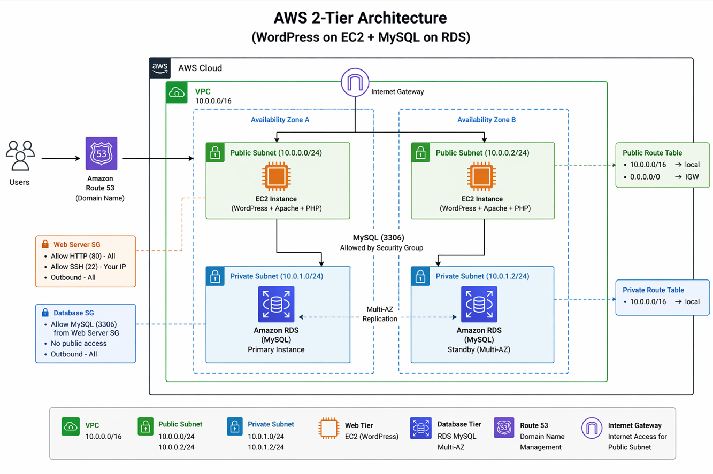
---

## Project Walkthrough

Below are step-by-step screenshots of the deployment process.

---

## Deployment Steps

### 1. VPC Setup

Created a custom VPC with CIDR block `10.0.0.0/16`.

---

### 2. Subnet Configuration

Created public and private subnets within the VPC:

* Public Subnet: `10.0.0.0/24`
* Private Subnet: `10.0.1.0/24`

---

### 3. Internet Gateway

Created and attached an Internet Gateway to enable internet access for the public subnet.

---

### 4. Route Tables

Configured route tables:

* Public route table → routes internet traffic via IGW
* Private route table → internal traffic only

---

### 5. Security Groups

Configured security groups for controlled access:

* Web Server SG:

    * Allow HTTP (80)
    * Allow SSH (22)
* Database SG:

    * Allow MySQL (3306) only from Web Server SG

---

### 6. EC2 Instance (Web Server)

Launched an EC2 instance in the public subnet:

* AMI: Amazon Linux 2
* Instance type: t2.micro
* Enabled public IP

Installed:

* Apache (httpd)
* PHP
* WordPress

Install Apache web server

Install php

Install SQL

Install wordpress tar

---

### 7. RDS Database (Private)

Created MySQL RDS instance:

* Deployed in private subnet
* No public access
* Connected via security group

RDS instance configured with a DB subnet group across private subnets and public access disabled, ensuring secure database deployment.
The RDS instance is deployed using a DB subnet group that includes multiple private subnets across different Availability Zones.

This ensures:
- High availability (multi-AZ readiness)
- Isolation from public internet
- Secure communication within VPC

---

### 8. WordPress Configuration

Configured WordPress by editing `wp-config.php`:

* Database name
* Username & password
* RDS endpoint

Updated WordPress security keys (salts) in `wp-config.php` to enhance authentication security.

Salts are cryptographic keys used to secure user sessions and cookies, preventing session hijacking and unauthorized access.

This step ensures the application follows basic security best practices.

---

### 9. Final Output

Successfully deployed WordPress application.

Access:
http://44.193.210.31/wp-admin

---

### 10. Configure Route 53

Configure Route 53 for domain name

---

## High Availability Upgrade (Multi-AZ Architecture)

To improve fault tolerance and scalability, the architecture was enhanced to be **highly available across all layers**.

---

### 11. Multi-AZ Network Setup

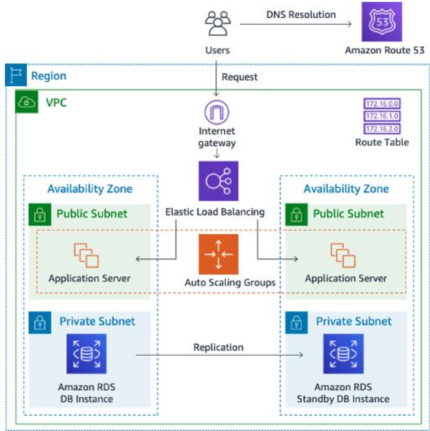
Created an additional public subnet in a different Availability Zone.

* Public Subnet 2: `10.0.3.0/24`
* Associated with public route table
* Enabled auto-assign public IP

This ensures the application is not dependent on a single Availability Zone.

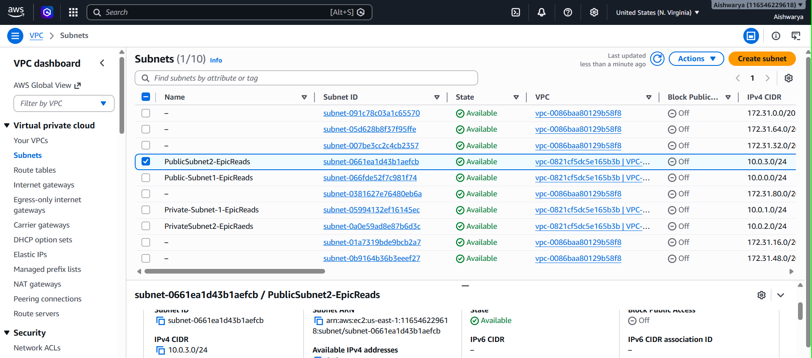
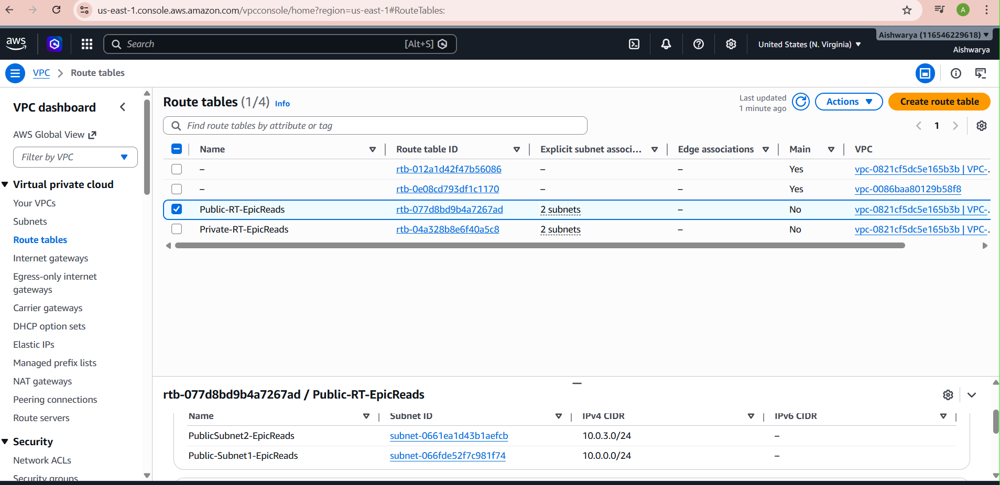
---

### 12. AMI Creation

Created an Amazon Machine Image (AMI) from the existing EC2 instance.

This AMI contains:

* Installed WordPress
* Apache & PHP configuration
* Application setup

This allows launching identical EC2 instances without repeating setup.

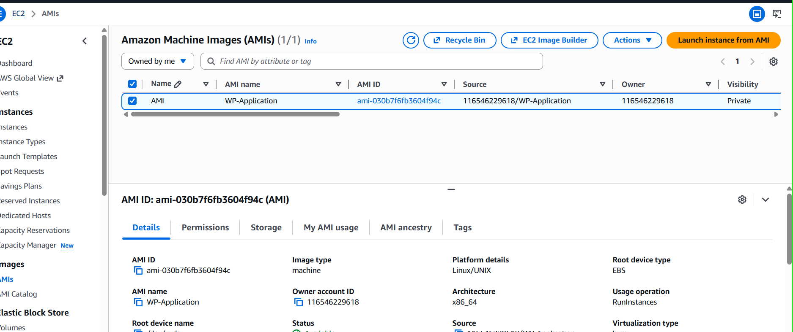

---

### 13. Launch Template Configuration

Created a Launch Template using the custom AMI.

Includes:

* Instance type: t2.micro
* Security group: Web Server SG
* Key pair
* User data script to start Apache

This standardizes EC2 instance creation.

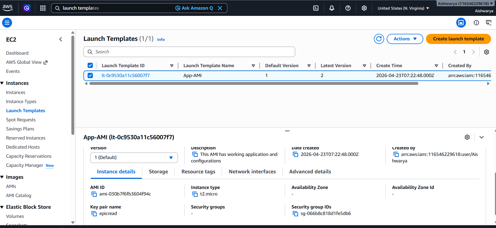

---

### 14. Auto Scaling Group (ASG)

Configured Auto Scaling Group using the launch template.

* Subnets: Both public subnets (Multi-AZ)
* Desired capacity: 2
* Min: 1
* Max: 4

This ensures:

* Automatic instance replacement
* Scaling based on demand
* High availability across AZs

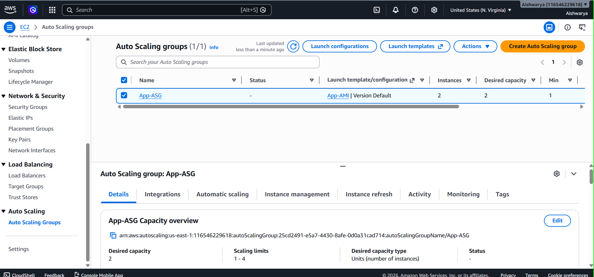

---

### 15. Target Group Configuration

Created a target group for EC2 instances.

* Protocol: HTTP
* Port: 80
* Health check path: `/`

This allows load balancer to route traffic only to healthy instances.

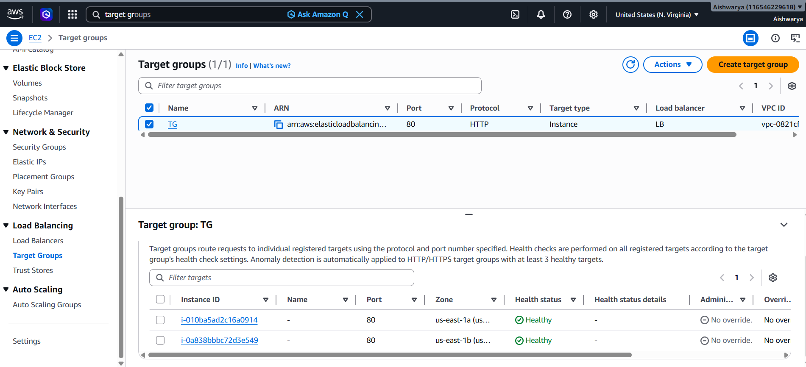

---

### 16. Application Load Balancer (ALB)

Created an internet-facing Application Load Balancer.

* Deployed across both public subnets
* Attached target group
* Configured security group (HTTP access)

The ALB distributes traffic across multiple EC2 instances.

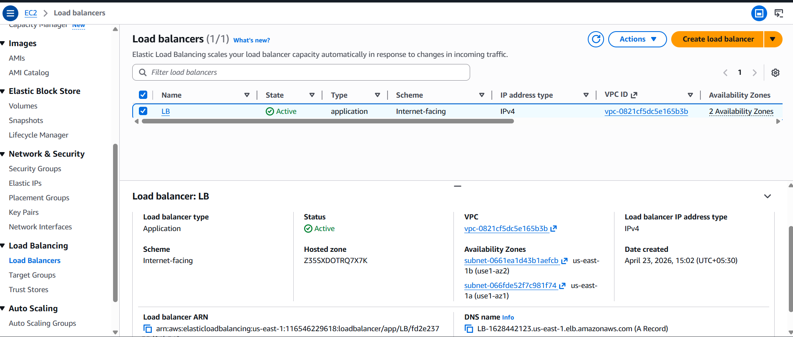

---

### 17. Application Access via Load Balancer

Application is now accessed using ALB DNS instead of EC2 public IP.

This ensures:

* No direct dependency on single instance
* Improved availability and reliability

---

### 18. RDS Multi-AZ Deployment

Enabled Multi-AZ for the RDS instance.

* Automatic standby database created in another AZ
* Synchronous replication enabled
* Automatic failover supported

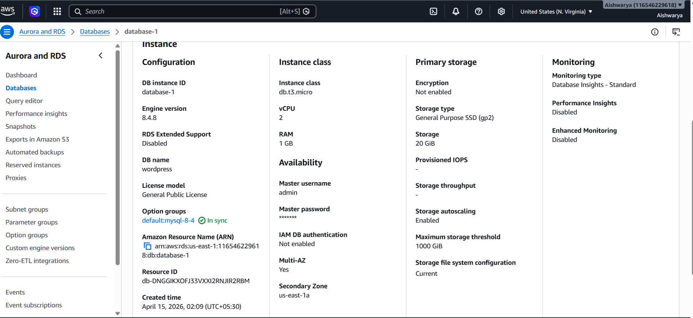

---

### 19. Read Replica

Created read replica for scaling read operations.

* Offloads read traffic from primary database
* Improves performance under heavy load

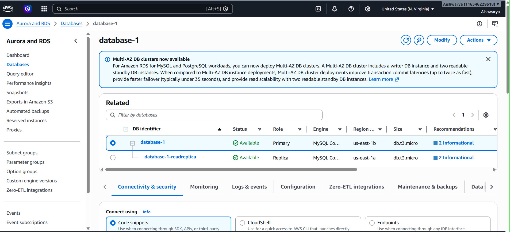

---

### 20. Route 53 Update

Updated Route 53 record to point to ALB instead of EC2.

* Used Alias record
* Improved reliability and scalability

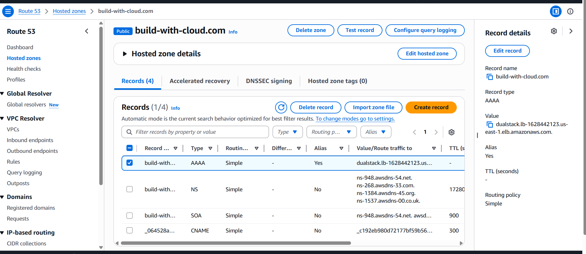

---

## Final Output

After configuring Route 53, the application is accessible via custom domain.

Traffic flows through:
Route 53 → ALB → EC2 → RDS
No direct dependency on EC2 public IP
Load balancer handles traffic distribution

---

## 🧰 AWS Services Used

* Amazon VPC
* Amazon EC2 (Auto Scaling)
* Application Load Balancer (ALB)
* Amazon RDS (MySQL, Multi-AZ, Read Replica)
* Amazon Route 53
* Internet Gateway
* Route Tables
* Security Groups

---

## Security Best Practices Implemented

* Database deployed in **private subnets**
* RDS **not publicly accessible**
* Implemented **security group chaining** (ALB → EC2 → RDS)
* Restricted SSH access to specific IP
* Isolated layers using **public and private subnets**
* Avoided direct access to EC2 by routing traffic through ALB
* Used custom VPC for controlled networking

---

## Key Learnings

* Designing scalable and highly available AWS architectures
* Understanding **Multi-AZ deployment and failover mechanisms**
* Working with **Auto Scaling and Load Balancers**
* Implementing **secure communication between tiers**
* Managing real-world cloud infrastructure components
* Understanding difference between **High Availability vs Scalability**
* Debugging real AWS deployment issues

---

## Challenges Faced

* Initial DB subnet group creation failed due to single AZ
* Resolved by adding private subnets across multiple AZs
* Understanding ALB + Target Group integration
* Debugging application downtime due to service/config issues
* Handling Route 53 DNS propagation delay

---

## Design Decisions

* Used **private subnets for RDS** to enhance security
* Introduced **ALB instead of direct EC2 access** for better availability
* Used **Auto Scaling + AMI + Launch Template** for scalable web layer
* Enabled **Multi-AZ deployment** to ensure failover capability
* Added **Read Replica** to handle read-heavy workloads
* Updated Route 53 to point to ALB instead of EC2 IP
* Balanced simplicity and real-world architecture design

---

